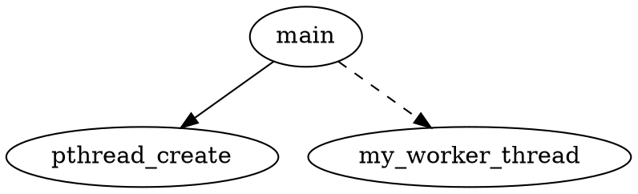

为了在实际的 C/C++ 项目中利用 **SVF** 获取最完整、最精确的调用链，我们需要解决两个实际工程问题：

1. **如何把整个项目的全量代码（含跨文件、跨目录依赖）完整编译并链接成一个 LLVM IR（`.bc`）文件**。
2. **如何正确配置 SVF 引擎，让它在精确度（指针分析、域敏感、上下文敏感）与大规模工程计算之间取得平衡**。

以下是完整的工业级落地详细操作步骤：

---

## 第一阶段：环境准备

我们推荐使用 Docker 或直接在 Linux（Ubuntu 22.04/24.04）上部署，因为大项目分析通常需要较大的内存。

### 1. 安装 LLVM 编译器生态

SVF 强依赖于 LLVM。确保系统安装了匹配版本的 `clang` 和 `llvm`（建议使用 LLVM 14 或 16，这是目前最稳定的版本）。

```bash
sudo apt-get install clang-14 llvm-14 llvm-14-dev

```

### 2. 安装 wllvm（全程序构建的神器）

现代项目（如 Redis, Nginx）通常包含大量 `Makefile` 或 `CMakeLists.txt`。普通 `clang -emit-llvm` 无法直接处理复杂项目。**`wllvm` (Whole Program LLVM)** 是业界标准工具，它能在编译项目的同时，暗中提取出完整的全局 `.bc` 文件。

```bash
pip install wllvm

```

### 3. 构建 SVF

从 GitHub 克隆并编译 SVF：

```bash
git clone https://github.com/SVF-tools/SVF.git
cd SVF
# 使用自自带的脚本可以自动下载依赖并完成编译
. ./build.sh

```

编译完成后，核心的可执行工具 `wpa` 将生成在 `SVF/Release-build/bin/` 目录下。

---

## 第二阶段：全程序代码提取（以实际项目为例）

假设我们要分析一个使用 `make` 或 `cmake` 构建的开源 C/C++ 项目。

### 1. 配置环境变量

告诉 `wllvm` 使用哪个版本的 Clang 进行底层编译：

```bash
export LLVM_COMPILER=clang
export LLVM_COMPILER_PATH=/usr/bin  # 根据实际 clang 路径填写

```

### 2. 配置并编译项目

使用 `wllvm` 替代传统的 `gcc` 或 `clang` 进行项目配置和编译：

* **如果是 `cmake` 项目：**
```bash
mkdir build && cd build
cmake -DCMAKE_C_COMPILER=wllvm -DCMAKE_CXX_COMPILER=wllvm++ ..
make -j$(nproc)

```


* **如果是 `./configure` & `make` 项目：**
```bash
CC=wllvm CXX=wllvm++ ./configure
make -j$(nproc)

```


### 3. 提取全局唯一的 `.bc` 文件

编译完成后，会生成最终的二进制可执行文件（例如叫 `my_server`）。此时运行 `extract-bc` 即可把散落在各个目标的 LLVM 字节码融合成一个全程序文件：

```bash
extract-bc my_server
# 这将在当前目录下生成一个名为 my_server.bc 的全局 IR 文件

```

---

## 第三阶段：运行 SVF 获取精确调用链

现在拿到了包含全程序视野的 `my_server.bc`，可以开始用 `wpa` 提取调用链。根据项目规模，选择不同的精确度策略：

### 策略 A：极致精确（适用于小到中型项目，约 10 万行代码以内）

开启最高精度的**安德森分析**，并加入**域敏感（Field-Sensitive）**，确保连结构体里的不同指针字段都能区分，这是解析 C++ 虚函数和复杂 C 指针调用的杀手锏。

```bash
/path/to/SVF/Release-build/bin/wpa \
  -ander \
  -field-sensitive \
  -dump-callgraph \
  my_server.bc

```

* `-ander`：启用高精度基于包含关系的安德森指针分析。
* `-field-sensitive`：域敏感，区分 `struct.a` 和 `struct.b`。
* `-dump-callgraph`：分析完成后导出调用图。

### 策略 B：大项目平衡（适用于百万行代码级别）

如果遇到极大型项目，策略 A 可能会消耗巨大内存（甚至 OOM）。我们需要引入**稀疏值流优化（Sparse Value-Flow）**，它只对敏感指针建立约束，大幅降低开销而几乎不损失精度：

```bash
/path/to/SVF/Release-build/bin/wpa \
  -fspta \
  -dump-callgraph \
  my_server.bc

```

* `-fspta`：启用流敏感且流稀疏（Flow-Sensitive & Sparse）的指针分析，在超大项目上表现极佳。

---

## 第四阶段：可视化与数据清洗

运行结束后，SVF 会在当前目录下生成一个名为 `callgraph.dot` 的文本文件。

### 1. 转换为图片查看

如果项目较小，可以用 Graphviz 转换为图片直接肉眼观察：

```bash
dot -Tpng callgraph.dot -o callgraph.png

```

在生成的图中，**实线**通常代表直接的函数调用（Direct Call），而**虚线**代表 SVF 通过指针分析和多态解析（VTA）计算出来的**间接调用路径（Indirect/Virtual Call）**。

### 2. 大项目的文本过滤

对于大型项目，图片会因过大而无法渲染。此时通常需要用脚本提取出调用链的邻接表进行后续分析。`callgraph.dot` 的内容格式如下：



你可以通过简单的 `grep` 过滤或者使用 Python 的 `networkx` 库加载该 `.dot` 文件，将其转化为一个图数据结构，直接进行任意两个函数之间是否存在调用链的路径查询。